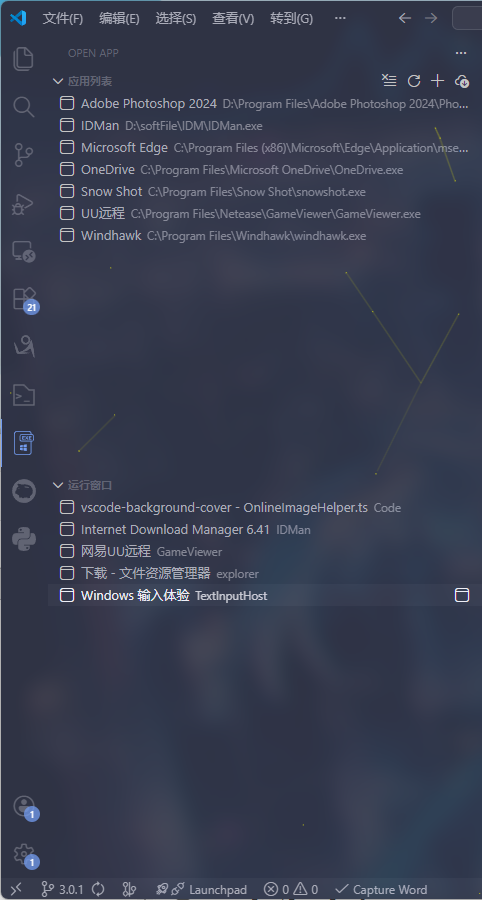

# Open App (Windows)

[English](./README_EN.md)

在 VS Code 侧边栏中快速管理和切换 Windows 桌面应用程序。

本扩展专为 Windows 开发者设计，旨在减少在开发过程中频繁切换窗口的干扰。它提供了一个集成的侧边栏，分为两个功能区：**应用启动器 (Launcher)** 和 **窗口切换器 (Switcher)**。

## ✨ 主要特性

### 1. 应用启动器 (App Launcher)
将常用的开发工具、外部软件或脚本固定在 VS Code 侧边栏，一键启动。

*   **手动添加**: 支持添加 `.exe`, `.bat`, `.cmd` 等可执行文件。
*   **智能导入**: 一键扫描桌面快捷方式和开始菜单，批量导入常用软件。
*   **管理便捷**: 支持重命名、删除、清空列表，配置自动持久化。

### 2. 窗口切换器 (Window Switcher) 
直接在 VS Code 内部查看和切换当前运行的 Windows 窗口，无需使用 `Alt+Tab`。

*   **实时列表**: 获取当前桌面上所有活动的应用程序窗口。
*   **一键切换**: 点击列表项，立即将目标窗口置顶并激活。
*   **智能过滤**: 自动过滤后台进程和工具窗口，只展示有意义的主窗口。
*   **中文支持**: 完美支持中文窗口标题显示。

### 3. 预览

## 📋 系统要求

*   **操作系统**: Windows 10 / 11 (仅支持 Windows 平台)
*   **依赖环境**: .NET Framework 4.5+ (通常 Windows 系统已内置，无需额外安装)

## 🚀 使用指南

### 启动与切换
安装插件后，点击活动栏 (Activity Bar) 中的 **Open App** 图标。

#### 📌 应用列表 (Launcher)
*   **添加**: 点击标题栏 `+` 号，选择可执行文件。
*   **导入**: 点击云下载图标，扫描系统快捷方式。
*   **启动**: 单击列表项即可启动程序。

#### 💻 运行窗口 (Running Windows)
*   **查看**: 展开“运行窗口”视图，查看当前打开的所有程序。
*   **刷新**: 点击刷新按钮更新窗口列表。
*   **切换**: 单击任意条目，立即跳转到该窗口。

## ⚙️ 常见问题

**Q: 为什么“运行窗口”列表是空的或者显示的窗口很少？**
A: 插件会自动过滤掉不可见的窗口、系统工具窗口以及没有标题的窗口。如果某些窗口未显示，请尝试点击刷新按钮。

**Q: 插件提示“WindowActivator.exe not found”？**
A: 插件依赖一个轻量级的 Native 组件来以高性能方式获取窗口信息。通常插件会在第一次运行时自动编译该组件。请确保您的系统未禁用 PowerShell 或 .NET 编译工具。

## ⌨️ 命令列表

您也可以通过 `Ctrl+Shift+P` (命令面板) 使用以下功能：

*   `Open App: 添加应用` (Append App)
*   `Open App: 自动导入应用` (Import Apps)
*   `Open App: 刷新列表` (Refresh App List)
*   `Open App: 刷新窗口` (Refresh Window List)
*   `Open App: 切换窗口` (Switch Window)

## 📄 许可证

MIT License. 详见 [LICENSE](LICENSE) 文件。
